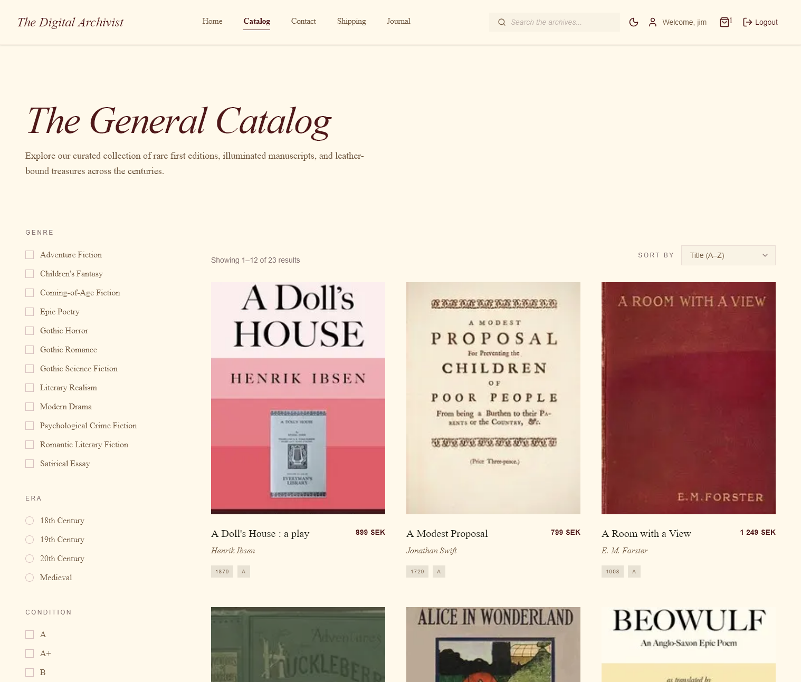
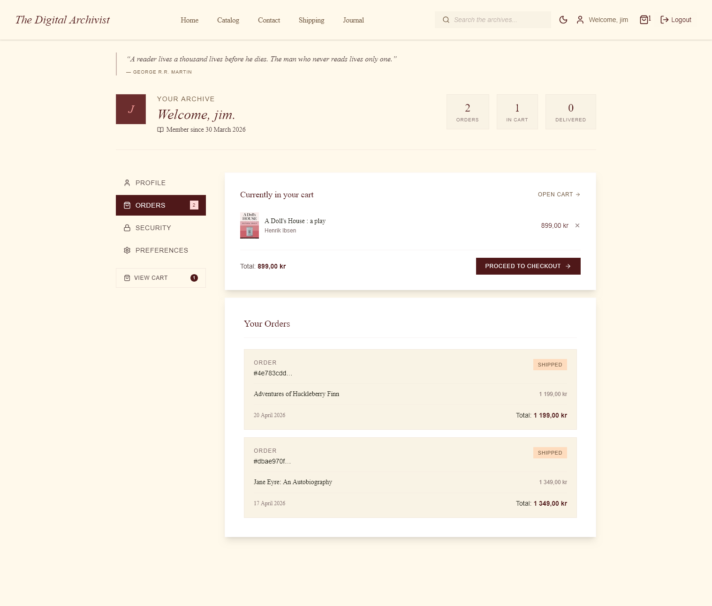
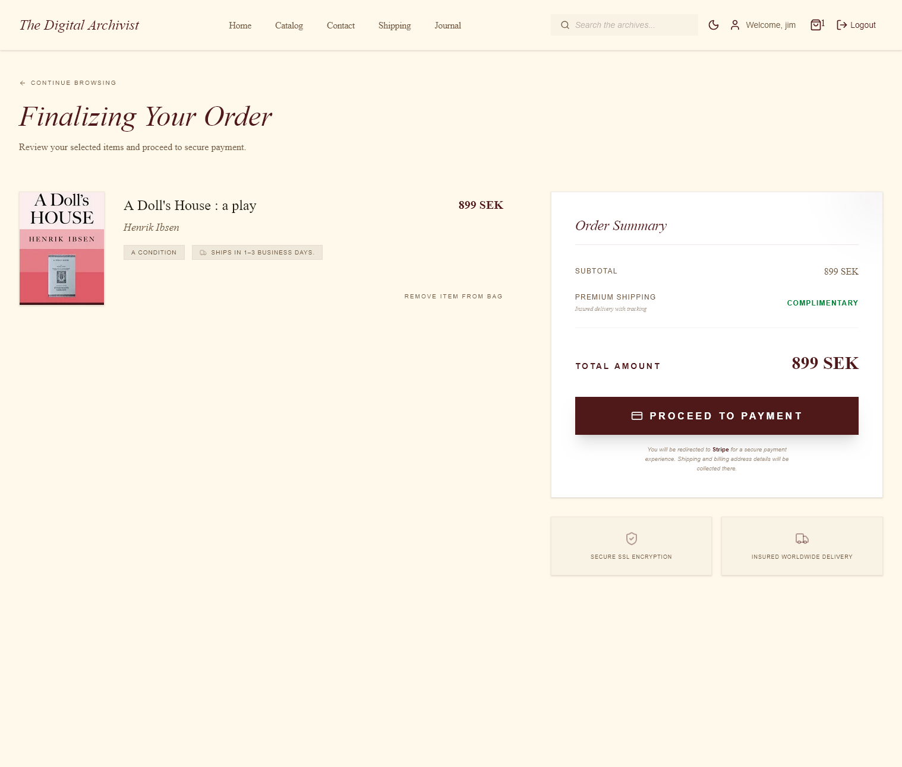
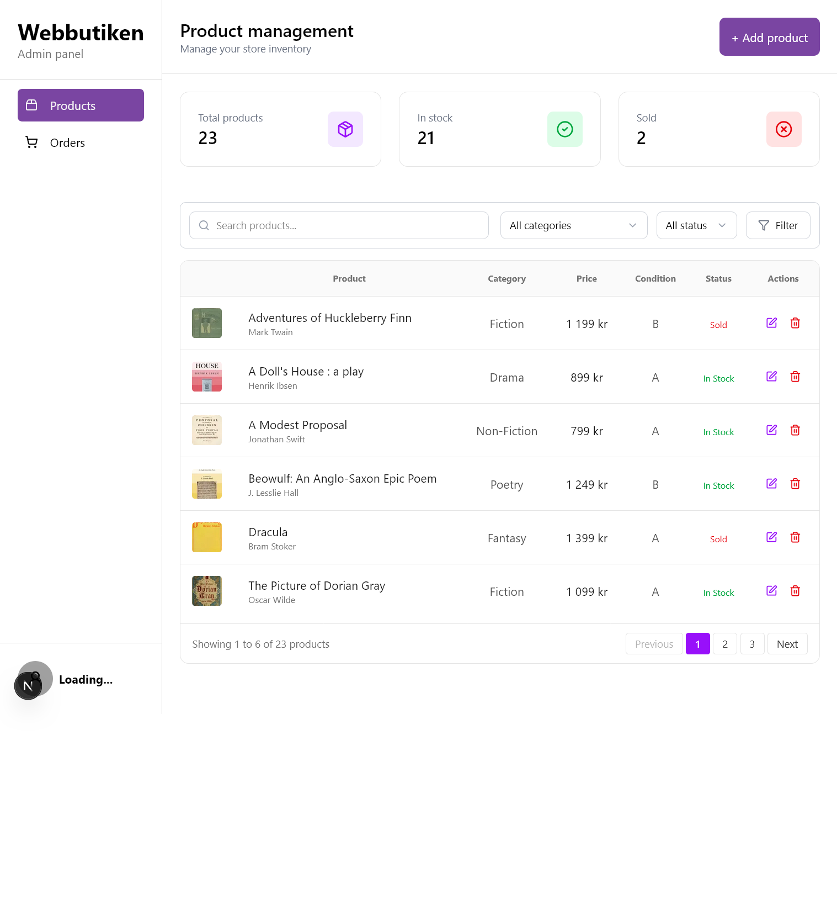
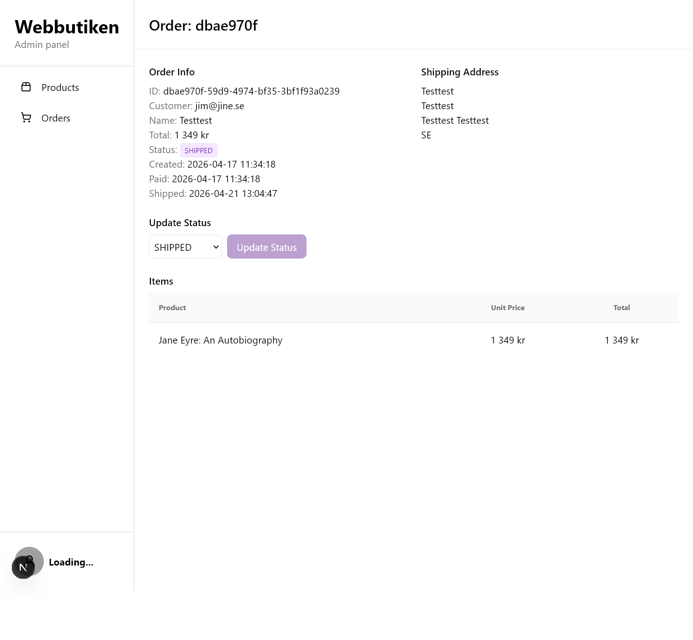

# The Digital Archivist 
### A full‑stack e‑commerce platform for vintage literature

Based upon design in Stitch: https://stitch.withgoogle.com/projects/18254047099019191933
## 📚 Built as a Final Project for Lexicon (Frontendutveckling 2025/2026)


## Webshop Screenshots

<table>
  <tr>
    <td><strong>Catalog Page</strong></td>
    <td><strong>Contact Page</strong></td>
  </tr>
  <tr>
    <td></td>
    <td></td>
  </tr>
</table>
<table>
  <tr>
    <td><strong>Account - Orders</strong></td>
    <td><strong>Checkout</strong></td>
  </tr>
  <tr>
    <td></td>
    <td></td>
  </tr>
</table>
<table>
  <tr>
    <td><strong>Admin - Products</strong></td>
    <td><strong>Admin - Orders</strong></td>
  </tr>
  <tr>
    <td></td>
    <td></td>
  </tr>
</table>

## 🛠️ Tech Stack

| Category        | Technology                 |
| :-------------- | :------------------------- |
| Framework       | Next.js (App Router)       |
| Language        | TypeScript                 |
| Styling         | Tailwind CSS               |
| Database & Auth | Supabase                   |
| ORM             | Prisma                     |
| Payments        | Stripe (test mode)         |
| Monorepo        | npm workspaces             |

---

## ✨ Features

- **🔐 Authentication** – Customer login via Supabase
- **☁️ Database** – Supabase + Prisma ORM
- **📦 Shopping Cart** – Persistent cart using useContext
- **💳 Payments** – Stripe integration (test mode)
- **🎨 UI Library** – Tailwind CSS, wireframed with Stitch
- **🌍 Deployment** – Vercel

## 🎨 Design System: The Digital Archivist

---

### 🔤 Typography

The Digital Archivist uses three complementary typefaces to create a scholarly yet inviting voice inspired by antique library catalogs.

| Role               | Font        | Usage                         |
| ------------------ | ----------- | ----------------------------- |
| Display & Headline | Newsreader  | Hero moments, titling faces   |
| Body               | Noto Serif  | Long-form scholarly critiques |
| Labels & Metadata  | Public Sans | ISBN, dates, publisher info   |

---

### 🎨 Color System

The visual identity of The Digital Archivist is built around a warm, parchment-inspired palette designed to feel like a rare book study.

The palette combines aged parchment backgrounds with muted burgundy accents to create strong contrast while maintaining a refined, scholarly aesthetic.

### 🎛️ Color Badges

**Primary (Very dark desaturated red)**  


**Secondary (Café Noir)**  


**Tertiary (Eerie Black)**  


**Neutral (Brilliant Pearl)**  


## 📁 Project Structure

This is a monorepo managed with npm.

Below is the previous / mockup file structure we've based this project on, please not that this is not accurate or up to date with the current code base
```bash

Lexicon-Final-Project/ (monorepo)
├── apps/
│ ├── webshop/ ← kund-facing Next.js app
│ │ ├── src/ ← rekommenderat: allt källkod i src/
│ │ │ ├── app/ ← App Router – definierar routes & API:er
│ │ │ │ ├── api/ ← Route Handlers = API endpoints
│ │ │ │ │ ├── products/
│ │ │ │ │ │ ├── route.ts → GET /api/products
│ │ │ │ │ │ └── [id]/
│ │ │ │ │ │ └── route.ts → GET/PATCH/DELETE /api/products/:id
│ │ │ │ │ ├── cart/
│ │ │ │ │ │ └── route.ts
│ │ │ │ │ ├── checkout/
│ │ │ │ │ │ └── route.ts
│ │ │ │ │ └── auth/...
│ │ │ │ │
│ │ │ │ ├── (shop)/
│ │ │ │ │ ├── layout.tsx ← t.ex. med produktnav & kundvagn
│ │ │ │ │ ├── page.tsx → / (eller /shop om du vill)
│ │ │ │ │ ├── products/
│ │ │ │ │ │ ├── page.tsx → /products
│ │ │ │ │ │ ├── [slug]/
│ │ │ │ │ │ │ ├── page.tsx → /products/t-shirt
│ │ │ │ │ │ │ └── loading.tsx
│ │ │ │ │ └── categories/
│ │ │ │ │ └── [category]/
│ │ │ │ │ └── page.tsx
│ │ │ │ ├── layout.tsx ← root layout (html, body, providers)
│ │ │ │ ├── page.tsx ← fallback / 404-liknande
│ │ │ │ ├── globals.css ← eller tailwind/global styles
│ │ │ │ ├── favicon.ico
│ │ │ │ └── robots.txt
│ │ │ │
│ │ │ ├── lib/ ← libs for like actions.ts and stuff.
│ │ │ │ ├── db.ts
│ │ │ │ └── actions.ts
│ │ │ ├── components/ ← återanvändbara UI-komponenter
│ │ │ │ ├── ui/ ← shadcn/ui, Radix, eller egna primitiver
│ │ │ │ │ ├── button.tsx
│ │ │ │ │ ├── card.tsx
│ │ │ │ │ └── ...
│ │ │ │ ├── layout/ ← stora layout-delar
│ │ │ │ │ ├── Navbar.tsx
│ │ │ │ │ ├── Footer.tsx
│ │ │ │ │ └── SidebarCart.tsx
│ │ │ │ └── feature/ ← feature-specifika komponenter (valfritt)
│ │ │
│ │ ├── public/ ← statiska filer
│ │ │ ├── images/
│ │ │ └── fonts/
│ │ │
│ │ ├── next.config.mjs / .ts
│ │ ├── tsconfig.json
│ │ ├── tailwind.config.ts
│ │ ├── postcss.config.js
│ │ └── package.json
│ │
├── packages/
│ ├── shared-types/ ← gemensamma zod-schemas, db-typer etc.
│ ├── ui/ ← gemensamma komponenter (valfritt senare)
│ └── db/ ← prisma schema + client (valfritt monorepo-paket)
│
├── package.json
└── .gitignore

```

---

## 🚀 Getting Started

### 1. Clone the repository

```bash
git clone https://github.com/seanie1995/Lexicon-Final-Project.git
cd Lexicon-Final-Project
```

### 2. Install the dependencies

```bash
npm install
```

### 3. Set up environment variables

Copy .env.example to .env and fill in your values.

### 4. Run the development server

```bash
npm run dev
npm run wenshop
npm run admin
```
